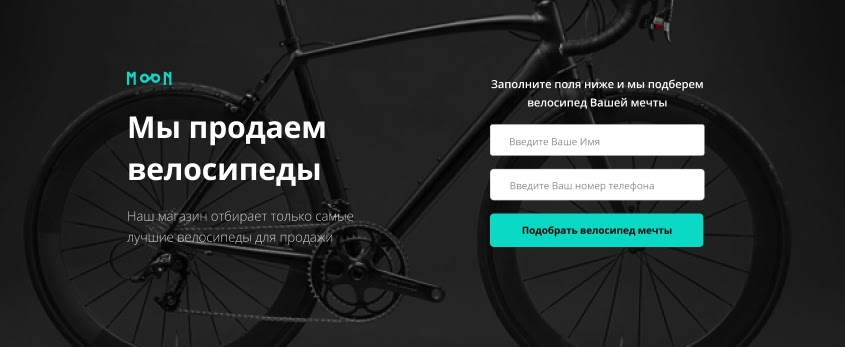
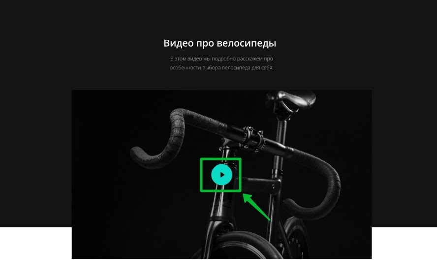
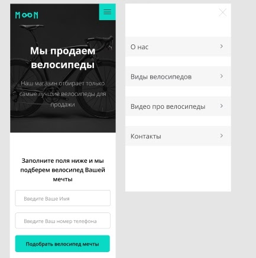

# Техническое задание Велосипеды

Проект должен соответствовать критериям качества.  
При конфликте технического задания и критериев, считать техническое задание более приоритетным.  

## Общие технические требования

1. Стандарты вёрстки: HTML5, CSS3, прогрессивное улучшение.
2. Сетка: определена в макете.
3. Раскладка блоков на странице делается с помощью флексбоксов.
4. Адаптивность сетки: мобильная, планшетная и десктопная версии. **Desktop First.** На всех промежуточных разрешениях используется резиновая вёрстка.
5. Используемая методология: БЭМ.
6. Используемые фреймворки: нет.
7. Используемый препроцессор: Sass (SCSS).
8. Используемый инструмент автоматизации: Gulp.
9. Кроссбраузерность: Chrome, Firefox, Safari, Edge, Internet Explorer 11.
10. Графика не предоставляется и её необходимо вырезать самостоятельно.
11. Нестандартные шрифты подключены локально.
12. JavaScript: мобильное меню, валидация формы.

## Пояснения по макету

1. Необходимо выполнить верстку одной страницы с адаптивностью. Десктопная, планшетная и мобильная версии.
2. Брейкпоинты :
    - мобильная версия — 320px - 767px;
    - планшетная версия — 768px - 1023px;
    - десктопная версия — от 1024px и выше
3. При клике по пунктам меню, страница скроллит к соответствующему разделу

4. Форма должна иметь валидацию.

5. Видео можно вставить при помощи картинки. Кнопка Play должна быть кликабельна.

6. Главное меню в мобильной и планшетной версии реализуется с применение JavaScript. Меню должны быть работоспособным при отключенном JavaScript.

В HTML- и CSS-коде должны быть предусмотрены элементы и правила для трёх возможных состояний:
  - Открытое меню потоке при отключённом JavaScript;
  - Открытое меню вне потока при включённом JavaScript;
  - Закрытое меню.

Скрипт открытия и закрытия меню должен работать так:
  - При инициализации скрипта меню должно убираться из потока (если в макете открытое меню не в потоке) и закрываться;
  - При клике на гамбургер меню открывается. Появляется кнопка-закрытие, убирается кнопка-гамбургер;
  - При клике на закрытие меню закрывается, убирается кнопка-закрытие, появляется гамбургер.
